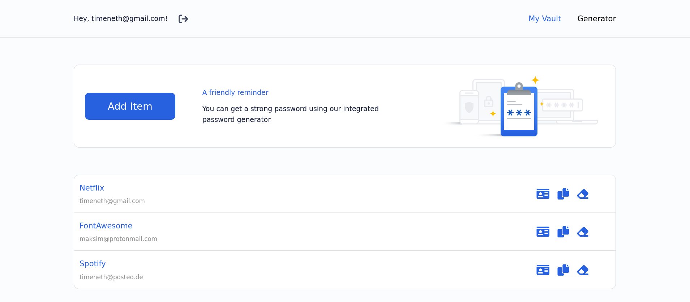
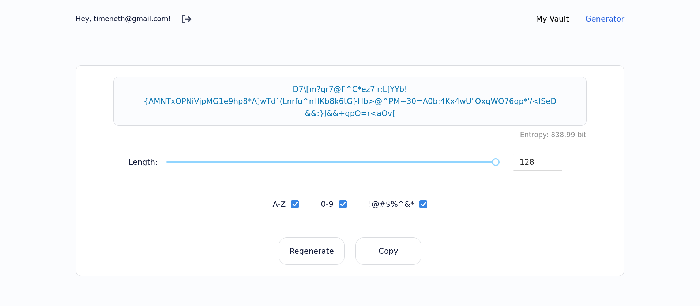

# Password Manager | MERN

A Password Manager project created using MERN stack

## Built using

#### Front-end

- [ReactJS](https://reactjs.org/) - Frontend framework
- [Redux](https://redux.js.org/) - State management library
- [Redux Thunk](https://github.com/reduxjs/redux-thunk) - Middleware which allows action creators to return a function
- [React Router](https://reactrouter.com/) - Library for general routing & navigation
- [React Hook Form](https://react-hook-form.com/) - Library for flexible & extensible forms
- [Yup](https://github.com/jquense/yup) - Form validation tool
- [Styled Components](https://styled-components.com/) - Component-level styles
- [Axios](https://github.com/axios/axios) - Library used to make HTTP requests from Node.js

#### Back-end

- [Node.js](https://nodejs.org/en/) - Runtime environment for JS
- [Express.js](https://expressjs.com/) - Node.js framework, makes process of building APIs easier & faster
- [MongoDB](https://www.mongodb.com/) - Open source NoSQL database management program
- [JSON Web Token](https://jwt.io/) - A standard to secure/authenticate HTTP requests
- [Bcrypt.js](https://www.npmjs.com/package/bcryptjs) - For hashing passwords
- [Dotenv](https://www.npmjs.com/package/dotenv) - To load environment variables from a .env file

## Features

- Authentication (login/register w/ email & master-password/Google OAuth)
- Generation of random, strong passwords with up to 128 symbols
- Set of regular expressions to calculate a password entropy
- CRUD credentials with platform, username & password
- Toast notifications for actions: copying, removing credentials etc.
- Content loaders for fetching processes
- Proper responsive UI for all screens

## UI Demo




## Project Setup

Navigate to the directory of choice and clone the project

```console
git clone https://github.com/tmneth/password-manager.git
```

## Setting up the server

To configure the server run the following command from the root directory

```console
cd server && npm install
```

Create .env file and configure environmental variables as follows

```js
CONNECTION_URI=<your MongoDB URI>
SECRET_KEY=<your secret key for hashing passwords>
```

Once all the dependencies were installed start the server

```console
npm run start
```

## Setting up the client

To configure the client run the following command from the root directory

```console
cd client && npm install
```

Create .env file and configure environmental variables as follows

```js
REACT_APP_GOOGLE_CLIENT_ID=<your Google OAuth client ID>
REACT_APP_SERVER_ACCESS=<your server URL>
```

Once all the dependencies were installed start the client

```console
npm run start
```
